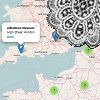

Points of interest related to handmade lace
===========================================

A map to share on websites of lace guilds, teachers, artists and collectors.
Anyone can contribute, a team of volunteers moderates it centrally.

Get involved
============

How to contribute to the markers on the map is explained at the bottom of the [demo] page.

A glitch free translation for the text around the map would be appreciated.
Automated translation don't do a very bad job for Dutch, German or French but
it might be an advantage for search engines to have an explicit translation.
On the other hand it increases the burden on maintenance. 

[demo]: http://lacemap.github.io/

Deploy your own copy of the map
===============================
Various options allow to deploy your own copy of the map and stay in sync or not.
Just two methods are sketched below.
Please note the [terms of use](#tile-service) for the tile server you choose: 
requiring an account, payed or not, allowing commercial use or not etc.

Just a customised address
-------------------------
The master lace map is deployed at http://lacemap.github.io/
* Create your own [fork] with the button at the top of this page, let us assume with an account name `my-org`.
* Go to settings, rename the repository `lacemap.github.io` to something of your choice, let us assume `lace-map`.
* Further down between the settings choose the `master branch` as [publishing source].

With the assumptions above, 
you should now have a map in English at `https://my-org.hithub.io/lace-map`
and a Dutch version at  `https://my-org.hithub.io/lace-map/NL`.
Github explains how to configure your own domain on the same settings page.

Now wait for updates that come as pull request messages
issued by the `lacemap` account and [merge them]
or read the instructions for a more technical approach to [stay in sync][fork].
After merging, you can check at `https://github.com/my-org/lace-map/deployments` whether the changes are published. It may take another ten minutes for your browser to see the changes.

[merge them]: https://help.github.com/en/articles/merging-a-pull-request#merging-a-pull-request-on-github
[publishing source]:https://help.github.com/en/articles/configuring-a-publishing-source-for-your-github-pages-site#choosing-a-publishing-source
[fork]: https://help.github.com/en/articles/fork-a-repo

Copy all assets
---------------
This approach assumes some knowledge of HTML an JavaScript
and the right to deploy custom JavaScript on your website.
* Extract `assets` plus `index.html` and/or `NL.html` out of the [download]. 
* Open  the `.html` page(s) with your favorite (plain text) editor.
* Replace the content of the `<body>` section with your own text and apply your own styles, keep at least: 

      

      

* Note that the map `
` needs a predefined size. This is defined in the head section with a percentage of the viewport (`vh` / `vw`).
* Open the `.html` page(s) in a browser and the map should show.
* Subscribe (at least) to the [history] of `assets/map-config.js` to get notified of new/changed entries.
  Replace the raw content of a changed file to get up to date.

How to embed and blend the page into your website completely depends on your implementation.

[download]: https://github.com/lacemap/lacemap.github.io/archive/master.zip
[history]: https://github.com/lacemap/lacemap.github.io/commits/master/assets/map-config.js.atom
 

Tile service
============

For another tile server edit your copies of the `.html` pages. Fill in the dots (see the [overview] of providers) and activate:

    laceMap.addTiles = function (map) {
          L.tileLayer(...).addTo(map);
     }

Please extend the attribution with:

    'Points &copy; <a href="https://github.com/lacemap/lacemap.github.io/" target="_top">lacemap</a> contributors'

Note the [terms] of use for the provider of your choice. 
[OSM] requires a cache of 7 days, that is 604.800 seconds, 
github's `cache-control` header is set to only `max-age=525010`.
A French variant allows only "marginal" traffic, whatever that may be.

The default settled for an alternative that gives German labels along the local labels,
[allowed] only for non commercial use.

[allowed]: https://www.openstreetmap.de/germanstyle.html
[OSM]: https://operations.osmfoundation.org/policies/tiles/
[terms]: https://wiki.openstreetmap.org/wiki/Tile_servers
[overview]: http://leaflet-extras.github.io/leaflet-providers/preview/index.html
[marginal traffic]: https://www.openstreetmap.fr/fonds-de-carte/

Options for `laceMap.load()`
============================

An alternative with an initial focus on France:

    laceMap.load({
      containerID: 'map',
      bounds: [[51,4],[42,8]],
      xyPrompt: 'Vous avez cliqué sur la carte à:'
    });

* **containerID** *mandatory*. The id of the HTML container for the map, this id should be unique on the page.
* **xy** *optional*, default \[0,20\]. The initial centre of the map.
  Click the map at the desired centre for the coordinates, swap the numbers.
* **zoomlevel** *optional*, default 1. The initial zoom level of the map.
* **xyPrompt** *optional*, default 'You clicked the map at:'. The text in the popup when you click an empty area of the map.
  The content and language of object popups is at the choice of the lacemap moderators, perhaps a local language and English.

Advanced options
================

For more advanced options and additional _leaflet_ [plugins] 
you'll have to adapt your copy of `assets/map-config.js`.

[plugins]: https://leafletjs.com/plugins.html
