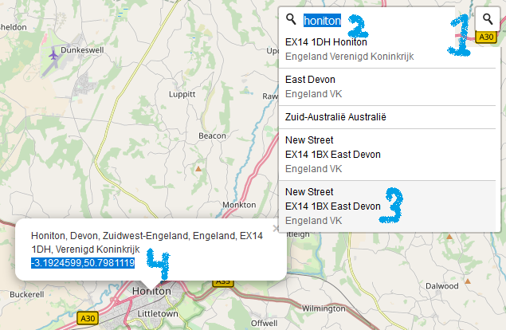

Links to add to this [list](assets/map-data.js) to get them on the interactive map.

Copy the coordinates from the search popup (you might need to repeat step 2 to get the pop-pu) and paste them before `www` on this page: 

Perhaps more links to curate from:  http://web.tiscali.it/merlettoitaliano/territorio/pescocostanzo_e.html

Pins to curate from [lacenews.net](https://lacenews.net/2016/03/09/administrative-pinterest-maps/) - Lace Museums
===========================================
Broken links should  be fixed but locations are not yet complete.

Germany,  Austria,  Switzerland
-----------------------

* 10.00973939873802,53.55108943052251 [www](http://www.mkg-hamburg.de/en/collection/permanent-collection/fashion/justaucorps-and-waistcoat.html) **Museum für Kunst und Gewerbe**,  Hamburg,  They have a lace collection<,  viewable by appointment only.
* 16.3815068356564,48.2074202 [www](https://sammlung.mak.at/sammlung_online?&q=spitzen) **MAK - Österreichisches Museum für angewandte Kunst/ Gegenwartskunst**,   Large collection of lace,  also lace from the Wiener Werkstätte.
* 13.7438061,51.0576715 [www](https://www.skd.museum/besuch/schloss-pillnitz/) **Museum für Sächsische Volkskunst mit Puppentheatersammlung** [archived event](https://web.archive.org/web/20140704230552/http://www.skd.museum/de/museen-institutionen/schloss-pillnitz/kunstgewerbemuseum/produktionsfest/index.html)
* 12.1356103,50.4941593 [www](http://www.plauen.de/de/tourismus/plauen-entdecken/plauener-spitze/spitzenmuseum.php) **Plauener Spitzenmuseum**, Plauen,  Germany
* 10.9625108,49.243589 [www](http://www.museen-abenberg.de/desktopdefault.aspx/tabid-315/754_read-15269/) **Klöppelmuseum Abenberg**,  Germany
* 8.17872298871944,50.76507435 [www](https://museen-in-hessen.de/de/museen/spitzen__und_leinenmuseum_haigerseelbach_) **Leinen- und Spitzenmuseum** Haiger-Seelbach  Seelbachstraße 9 (Ortsmitte),  35708 Haiger-Seelbach (im alten Rathaus),  Germany
* 12.099031,48.50673385 [www](https://tiefenbach-opf.de/tiefenbach/kultur/museum-ehemalige-kloeppelschule/) **Gemeinde Tiefenbach - Museum ehemalige Klöppelschule** - former lace school museum.

Russia
-----------------------
* 38.49762161383901,52.60287938088806 [www](http://www.tripadvisor.com/Attraction_Review-g2540845-d6680459-Reviews-House_Museum_of_Yelets_Lace-Yelets_Lipetsk_Oblast_Central_Russia.html) **House Museum of Yelets Lace**
* 30.314845980700053,59.93968572832177 [www](https://www.hermitagemuseum.org) **The State Hermitage Museum: Collection Highlights**,  There is lace at the Hermitage,  but it's difficult to find on their website.
* 49.69483800747652,58.606404272224715 [www](http://russia-ic.com/culture_art/visual_arts/1004/#.UweIFoUZrig) **Kukarka Lace** :: Visual Arts :: Culture & Arts :: Russia-InfoCentre,   Kurkarka (Sovetsk) school for lacemaking (Professional College 28),  and associated museum. From [wikipedia](https://ru.wikipedia.org/wiki/%D0%9A%D1%83%D0%BA%D0%B0%D1%80%D1%81%D0%BA%D0%BE%D0%B5_%D0%BA%D1%80%D1%83%D0%B6%D0%B5%D0%B2%D0%BE) Currently  ... lace cooperative “Kukarskoe lace”
* 38.13314653950487,56.31360861287357 [www](http://en.museum-sp.ru/collection/istoriko-khudozhestvennaya-kollektsiya-xiv-xxi-vv/zoloto-serebryanoe-kruzhevo-xvii-nachala-xx-v) **The Sergiev-Posad Museum** 141310 Prospekt Krasnoi Armii 144, Sergiev Posad
* 30.3337947776176,59.93794215 [www](https://en.wikipedia.org/wiki/Russian_Museum_of_Ethnography) **The Russian Museum of Ethnography**,  They do have a lace collection.
* 39.8848816427303,59.22382245 [www](http://www.vologdamuseum.ru/content?id=131) **кружевной гербарий (Kremlin Square) 12 Vologda Lace Museum**,  Russia,  Very new facility.
* 38.36974576686367,59.85774071379745 [www](http://www.kirmuseum.ru/en/visitor/virtexhibition/detail.php?ID=126712) **Vologda Lace from the Collection of the Kirillo-Belozersky Museum-Reserve**,  Russia, prices up to 2012, news items up to 2015 [vologdamuseum](http://www.vologdamuseum.ru/content?id=59#pic004) the “Lace Fabrics” collection includes more than 4200 items

USA
-----------------------
* -86.1858389057633,39.82596175 [www](http://collection.imamuseum.org/results.html?query=lace&page=77) **Indianapolis Museum of Art**,  They have a lace collection,  but no photographs on their search site.
* -73.9633157304714,40.6709108 [www](https://www.brooklynmuseum.org/opencollection/tags/lace) **Brooklyn Museum**
* -72.6730839890199,41.76346815 [www](http://thewadsworth.org/collection/costumeandtextiles/) **Hartford Wadsworth Atheneumm**
* -71.4085056875,41.8263785 [www](https://risdmuseum.org/art-design/collection?search_api_fulltext=lace&field_on_view=1&field_type=All) **Rhode Island School of Design Museum**
* -71.0938964010892,42.3394576 [www](http://www.mfa.org/collections/object/lace-47014) **Museum of Fine Arts**,  Boston,  They have a lot but little is photographed.
* -71.0991546047242,42.3382438 [www](http://www.gardnermuseum.org/collection/artwork/3rd_floor/veronese_room/lace_panel?filter=room:1806) **Isabella Stewart Gardner Museum** : Her collection had over 100 pieces.
* -76.6194946144439,39.32585585 [www](https://www.artbma.org/collections/textiles.html) **Textiles - Baltimore Museum of Art**,  Includes the lace collection of Claribel and Etta Cone,  nearly 400 laces.
* 1.15072507733578,52.06053845 [www](https://ipswichmuseum.org/) **Ipswich Museum**,  excellent collection from the local Ipswich lace industry, Ipswich,  Massachusetts
* -79.08174793903451,37.55752245704899 [www](https://sbc.edu/museum/collections/) **Sweet Briar College Museum**,  Houses the lace collection of College founder Indiana Fletcher Williams,  and in 2003 received the Barber-Connin collection,  This is one of the reasons "Lace at Sweet Briar" is held there every year.
* -73.9576990287357,40.7842843 [www](http://collection.cooperhewitt.org/search/?q=lace) **Searchable index at the Cooper Hewitt National Design Museum** Washington DC,  This is a beta test site,  so is a little flaky at the moment.
* -73.9466347486007,40.83336025 [www](http://www.hispanicsociety.org/) **Textiles at the Hispanic Society of America**,  They have a collection of lace,  but it is not mentioned on their website,  613 West 155th Street,  New York,  NY 10032. [archived](https://web.archive.org/web/20160318002903/http://hispanicsociety.org/hispanic/textiles.htm) page
* [www](https://www.egausa.org/index.php/) **00149 Point de Gaze Handkerchief - The Embroiderers' Guild of America permanent collection**,   There is lace in this collection,  however you have to be a member of the guild to fully scope it out.
* -105.07395076002643,40.56897153047087 [www](http://www.dm.chhs.colostate.edu/museum/avenir-gallery.aspx) **Avenir Museum of Design and Merchandising**,  Colorado State University,  the Ruth Payne Hellman lace collection.
* -67.11145589007515,18.3942335338268 [www](https://web.archive.org/web/20160304170905/http://www.museodelmundillo.org:80/) **Museo del Mundillo in Moca**,  Puerto Rico,  USA,  Facebook page at [facebook](https://www.facebook.com/museodelmundillo)
* -88.22833223301814,44.44560186421278 [www](http://wisconsinobject.wordpress.com/2011/03/17/now-online-lace-from-oneida-nation-museum/) **Lace from the Oneida Nation Museum** [archived](https://web.archive.org/web/*/https://oneida-nsn.gov/our-ways/museum/)
* -73.9633641138519,40.77944365 [www](http://www.metmuseum.org/collections/search-the-collections?ft=lace) **Metropolitan Museum of Art** searchable collection index.
* -93.0218685,41.3247198 [www](http://www.artic.edu/aic/collections/artwork/3763?search_no=2&index=15) **Bertha Collar / The Art Institute of Chicago**,  An important collection,  but very short on photos so far,  [Searchable index](http://www.artic.edu/aic/collections/artwork-search/results/lace).
* [www](http://www.flaglermuseum.us/lace-exhibit) **Lace_Exhibit in the Flagler Museum**,  Palm Beach,  Florida.
* -93.2741525554116,44.95859455 [www](https://collections.artsmia.org/index.php?page=dats) **The Minneapolis Institute of Arts** has a ~500 piece collection of lace,  some of which was shown during the 2012 IOLI convention.
* -77.0235232,38.8978291 [www](http://www.flickr.com/photos/orlacarey/sets/72157623912286524/) **Smithsonian Museum of American History Lace Collection**,  Views of the lace storage room.
* -81.6117367219063,41.5090438 [www](http://www.clevelandart.org/art/collection/search?collection_search_query=lace&year_operator=1&year=&year_era=1&year_end=&year_end_era=1&op=search&form_build_id=form-GgyjpNZS_gzW7ZIqO6FkrZYCz7hg-UpNecNH-808-OU&form_id=clevelandart_collection_search_form) **Cleveland Museum of Art**,  Search for 'lace' in their collections.

UK and Ireland
-----------------------

* -6.285779364798226,53.348834529376795 [www](https://www.museum.ie/The-Collections/Art-Industry/Art-Industry-Collections-List/Lace-Collection) **National Museum of Ireland lace collection**,  Especially Irish lace and lace deisgns from mid 19th to mid 20th c.
* -9.5847224,51.8807489 [www](http://www.kenmarelace.ie/?page_id=176) **Kenmare Lace and Design Centre**,  The Square,  Kenmare,  Co,  Kerry,  Ireland.
* -1.95642933591386,51.9473749 [www](https://sudeleycastle.co.uk//) **Sudeley Castle**,  Winchcombe,  UK,  They have an excellent lace collection along with other historic textiles.
* -2.0967983,51.583616 [www](http://www.athelstanmuseum.org.uk/collection_lace_malmesbury.html) **Athelstan Museum**,  Malmesbury lace collection
* -1.9154819205163,54.54205995 [www](http://www.thebowesmuseum.org.uk/Collections/ExploreTheCollection/ByCollection/FashionandTextiles/Top10FashionTextiles.aspx) **The Bowes Museum**  - houses the Blackborne lace collection.
* -2.24139425145136,53.47866855 [www](http://www.manchestergalleries.org/our-other-venues/platt-hall-gallery-of-costume/) **Gallery of Costume**,  Manchester Art Gallery,  Extensive collection of lace,  primarily available by appointment.
* -0.8150469,51.817258 [www](https://www.buckscountymuseum.org/museum/) **Waddesdon manor lace collection**,  collected by Baroness Edmond de Rothschild [archived](https://waddesdon.org.uk/the-collection/explore-the-collection/costume-lace-accessories/).
* -0.8150469,51.817258 [www](http://www.buckscc.gov.uk/bcc/museum/history_gallery.page) **Buckinghamshire County Museum** - one of the best collections of lace and lacemaking equipment in the country.
* -3.532039882815029,50.7251523424952 [www](https://rammcollections.org.uk/?s=lace&post_type=object) **Royal Albert Memorial Museum & Art Gallery**,   The "Duchesse of Albany" Honiton lace flounce designed by Treadwin,   The collection of this museum was featured in the new book about Treadwin.
* -1.153585405670419,52.958662493815 [www](http://www.ntu.ac.uk/apps/news/94180-15/New_archive_for_University's_historic_lace_collection.aspx) **Lace Heritage**,  School of Art and Design,  Nottingham Trent University.Their Lace Archive includes 75,000 items of lace,  which have been acquired from bequests by local companies and the Nottingham Lace Federation.
* -7.641402471643352,54.296422917999436 [www](http://www.irishlacemuseum.com/) **Sheelin Antique Irish Lace Museum and Shop**,  Ireland
* -0.2136749881901978,51.496460233616475 [www](http://www.vam.ac.uk/page/c/clothworkers-centre/) **The Victoria and Albert Clothworkers' Centre for the Study and Conservation of Textiles and Fashion**,   Grand opening October 8,  2013,  All the lace formerly in the main V&A building has been moved here.
* -0.418322641882922,51.89466025 [www](https://www.culturetrust.com/venues/wardown-house-museum-gallery) **Wardown Park Museum**,  formerly the Luton Museum and Art Gallery,  The Threads of Life Gallery was inaugurated in 2012 and displays some of their extensive lace collection. [archived](https://web.archive.org/web/20160304170905/https://www.lutonculture.com/wardown-park-museum/galleries-and-exhibitions/lace/) page
* -0.7008267963896021,52.15247615771748 [www](http://www.cowperandnewtonmuseum.org.uk/lace-making/) **The Cowper and Newton Museum in Olney**,  Buckinghampshire,   Thomas Wright was the first custodian of the museum.
* -2.1554972214587758,52.47268999979764 [www](https://www.laceguild.org/visiting-the-hollieshttps://www.laceguild.org/visiting-the-hollies) **The Lace Guild** - The Lace Guild Museum

Italy and Malta
-----------------------

* 13.6280323,45.9430253 [www](https://musei.regione.fvg.it/index.php?page=it/musei_e_archivi/musei_provinciali_di_gorizia/museo_della_moda_e_delle_arti_applicate/) **Museo della Grande Guerra di Gorizia**,  Dedicated to the first World War,  this museum also has a few rooms dedicated to lacemaking in the area.
* 12.4815341,41.8963664 [www](http://www.museopalazzovenezia.beniculturali.it/index.php?en/1/home) **National Museum of the Palazzo Venezia**,  Apparently it has an extensive lace collection,  documented in 2014 in "Storie di Abiti e Merletti',  and the collection is in need of restoration,  Not sure how students can access the collection.
* 14.2397307031073,36.04655650378655 [www](https://heritagemalta.org/gran-castello-historic-house/) **The Folklore Museum in Victoria**,  Gozo.
* 8.158326880028653,45.88942575591717 [www](http://www.comune.fobello.vc.it/Home/Guidaalpaese/tabid/14302/Default.aspx?IDPagina=5630) **Museo/Mostra del Puncetto**,  Fobello,  Italy,  They also have displays on the history of costume in the area.
* 12.094360520039237,43.02845439520854 [www](http://www.paolamatteucciricamo.com/) **PAOLA MATTEUCCI Ricamo su tulle Ars Panicalensis-Ricamo a mano**,   Museum dedicated to embroidered net,  They also have a school.
* 7.685829308603497,45.07090597769728 [www](https://www.palazzomadamatorino.it/en/le-collezioni/collection-online?combine=lace) **Palazzo Madama lace collection** Turin.
* 13.0938188,46.1131698 [www](http://www.turismofvg.it/Museums/Friulian-farmer-s-life-museum-cjase-Cocel-Fagagna) **Cjase Cocel museum**,  Fagagna,  Province of Undine in the Friuli-Venezia Giulia region,  Italy,  Highlights the tradition of Fagagna bobbinlace based on the Lace School at San Vito,  Undine,  The school was founded by American expatriate Countess Cora Slocumb di Brazzà.
* 9.175727,45.5477706 [www](http://www.museopoldipezzoli.it) **Textiles / Museo Poldi Pezzoli**,  Milan,  An excellent lace collection housed in cabinets on the ground floor,  Best to ask guard for location.
* 13.6880618,42.9337343 [www](http://www.turismoffida.com/it/museo-del-merletto.html) **Museu di Merletto**,  Offida,  Italy
* 12.72850267928281,42.91135326772417 [www](http://www.museocaprai.it/ita/index.php) **Arnaldo Caprai Museum Collection**,  online,  This is one of the largest textile collections in the world,  especially good in Lace,  It has an associated Study and Research Centre,  But I'm not entirely sure where everything is physically located.
* 9.23844521272957,44.3462408 [www](http://www.comune.rapallo.ge.it/pagina516_il-museo-del-merletto.html) **Museo del Merletto Rapallo**,  Italy
* 14.0657891,41.890246 [www](https://www.facebook.com/museotombolopescocostanzo/) **Museo del Tombolo** - Pescocostanzo,  l'Aquila,  Italy.
* 12.391600374327776,45.57356287912275 [www](https://web.archive.org/web/20120717055359/http://www.camaffio.com/EN/merletto.html) **Ca' Maffio and lace Making Venetian art**,  This is a (closed) hotel halfway between Venice and Treviso,  that for some reason managed to acquire what was left of the Levi Moreno lace collection from the Jesurum manufactory.
* 12.0902595526615,43.17702495 [www](http://www.umbriaonline.com/tuoro-trasimeno-museo-merletto.phtml) **Museo del Merletto di Isola Maggiore**
* 9.90305092695055,45.81085485 [www](https://www.museobasilica.com/merletti-2/) **Museo della Basilica di Santa Maria Assunta**,  Piazza Emancipazione, 24024 Gandino (BG),  Italy.
* 11.2527482,43.7701712 [www](https://www.visitflorence.com/florence-museums/palazzo-davanzati.html) **Polo Museale Fiorentino :: Sito Ufficiale**,  Palazzo Davanzati,  Florence,  Excellent lace display in the Studiolo and Camera dei Pavoni.

Eastern European Countries

-----------------------
* 14.416436080594195,50.08988019347746 [www](http://www.upm.cz/index.php?language=en&page=190) **Museum of Decorative Arts in Prague**,  Apparently has lace,  but little information about it on their website.
* 18.953414806588988,49.54898508501323 [www](https://www.kamratowo.pl/en/guide/museum-lace-koniakow.html) **Poland - Point Lace Museum** Koniakow
* 19.0682019860933,47.4859506 [www](http://www.imm.hu/en/contents/28,Textile+and+Costume+Collection) **Museum of Applied Arts in Budapest**,  Hungary,  They have an extensive lace collection. Closed jan 2018 for renovations
* 19.48894404121102,46.43051389840775 [www](http://www.ohb.hu/tourism/csipke/index.en.html) **Lace House - Halas Lace Museum**, Kossuth utca 37, Kiskunhalas, Hungary
* 16.29388565930268,50.11775708296077 [www](http://www.duo-kunsthandwerk.eu/skofja_loka_sl/detail/95) **Galerija Hiša klekljanih čipk A**,  Primožič 1888,  foto: Mili Primožič,  Žiri,  Slovenia
* 16.2938525,50.1177888 [www](https://www.vkrajka.cz/) **Vamberk Lace Shop**,  Žamberecká 380, 517 54, Vamberk
* 13.998226068861129,49.01223116501201 [www](http://www.muzeumkrajky.euweb.cz/english.htm) **Muzeum krajky v Prachaticích - Czech Republic**,  MUSEUM OF BOBBIN LACES AT PRACHATICE,    CZECH REPUBLIC
* 14.018931975,46.00067185 [www](http://www.muzej-idrija-cerkno.si/) **Mestni musej Idrija**,  Slovenia,  The lace is in the Gewerkenegg Castle.

France
-----------------------
* 2.3783515847820795,49.017071280969745 [www](https://musee-renaissance.fr/collection/arts-du-textile) **Salle des tissus / Musée National de la Renaissance Château d'Ecouen**, There is a book "Les Dentelles - Musée National de la Renaissance Château d'Ecouen" about the lace collection,  published in 1992.
* 6.368384429855982,46.116382128621304 [www](http://www.museedelafemme.fr/page2.html) **Musee de la Femme**,  Faucigny,  France,   Looks like they have a good lace collection. On appointment only.
* 3.4116243410027822,50.1251714801029 [www](https://musee-dentelle.caudry.fr/) **Musée des Dentelles et Broderies Caudry** Place des Mantilles, 59540 Caudry [facebook](https://www.facebook.com/DentelleCaudry)
* 2.3330193,48.8632548 [www](http://www.lesartsdecoratifs.fr/francais/mode-et-textile/) **Les Arts Décoratifs - Mode et textile**,  107 rue de Rivoli,  75001 Paris,  France,  It is located in the Louvre Museum,  Years ago I visited Anne Kraatz there and saw some of the lace collection,  Not sure of the status at this time.
* 4.831371424695475,45.75331513140228 [www](http://www.mtmad.fr/fr/Pages/default.aspx) **Musée des tissus et des arts décoratifs in** Lyon,  France,  They do have a lace collection,  I find their [regular website](http://www.musee-des-tissus.com/) very difficult to view.
* 6.1351507,48.3003076 [www](http://www.cityvox.fr/musee_mirecourt-88/maison-de-la-dentelle_92553/PhotosLieu) **Maison de la Dentelle**,  Mirecourt,  France

Nordic Countries
-----------------------
* 8.86991,54.935503
 [www](https://msj.dk/udstillinger/) **The Lace Museum in Tønder is in the Drøhses Hus**,  a museum associated with the Museum Sønder Jylland.
* 14.8973094,58.4480785 [www](http://www.spetsmuseet.se/) **Vadstena Spetsmuseum**,  Sweden
* 14.347786277213604,55.55626119175183 [www](https://www.simrishamn.se/kultur-och-fritid/osterlens-museum) **Österlens museums in Skåne**,  Sweden,  They lent lace material to the American Swedish Institute for their Nordic Lace exhibition in 2012-2013.
* 21.5112450162186,61.12798355 [www](https://www.rauma.fi/museo/vanha-raatihuone/) **The Rauma Museum lace collection**,  Rauma,  Finland.

Belgium & the Netherlands
-----------------------
* 6.6835022,53.4193202388889 [www](http://www.museum.nl/museum/Kantmuseum.aspx) **Kantmuseum**,  Uithuizen,   Very little information on this museum on the web.
* 4.39208198912049,50.83933456288292 [www](http://www.kmkg-mrah.be/closed-galleries) **Musée du Cinquantenaire**,  Koninklijke Musea voor Kunst en Geschiedenis,  Brussels,  The Salle van Overloop is now closed (as in 2016 so in 2019),  but the magnificent lace collection remains in storage.
* 4.1650708,50.4101573 [www](http://walloniebelgiquetourisme.be/fr-be/content/centre-de-la-dentelle-et-des-metiers-dart-de-binche-le-fuseau) **Centre de la Dentelle et des Métiers d’ Art de Binche**,  [Le Fuseau](http://www.dentelledebinche.net/)
* 4.4006317,51.2182199 [www](http://www.momu.be/en.html) **ModeMuseum**,   Antwerp,   It has a large lace collection. Reopens autumn 2020
* 4.8850584324552,52.3598759 [www](https://www.rijksmuseum.nl/en/search?v=&s=&q=kloskant&ii=0&p=1) **the Rijksmuseum** Amsterdam,   Search on 'kloskant',   Outstanding collection,  much of which was formed with the aid of Het Kantsalet,  an organization founded in 1925.
* 5.3411197665972985,50.223528368970996 [www](http://dentellesdemarche.be/) **Musée de la Dentelle** Marche-en-Famenne
* 4.5426311685185,51.0242489 [www](http://www.kantcentrumbonheiden.be/?plugin=plugin_standaard&menustruktuur_id=84) **Museum Mechelse Kant**,  Kantcentrum,  Sint-Maartensberg,  1,  2820 Rijmenam,  Belgium
* 4.4046192,51.2212457 [www](http://www.carolusborromeus.com/index.php?page=de-kantkamer) **Carolus Borromeuskerk**,  Antwerp,  One room is devoted to a lace museum.  [OKV](http://www.tento.be/OKV-artikel/de-kantkamer-van-de-carolus-borromeuskerk-uit-de-ochtendnevel-gesneden) - [Kurella](http://lacecurator.info/collecting-lace/lace-in-belgium-wednesday.html)
* 3.255404,50.8308666 [www](https://www.texturekortrijk.be/) **Vlasmuseum (Flax Museum) in Kortrijk**,  Belgium,  Closed until mid 2014,  It is moving to a new building in the center of town.

Spain & Portugal
-----------------------
* 2.4006097,41.5537249 [www](http://puntairesargentona.blogspot.com/2013/01/la-colleccio-de-puntes-dargentona-es.html) **PUNTAIRES D'ARGENTONA: La Col.lecció de Puntaires d'Argentona.**
* -3.712558635513266,38.88897708441986 [www](http://www.almagro.es/museos/museo.htm) **Museo del Encaje y la Blonda** Almagro
* -9.3812344,39.3550089 [www](http://www.cm-peniche.pt/CustomPages/ShowPage.aspx?pageid=8b428ce8-25d0-402b-9504-74b56df84783) **City Museum &gt; Collections** &gt; Trimmed Lace - Município de Peniche,  Portugal
* -0.9612662,37.6901329 [www](http://www.regmurcia.com/servlet/s.Sl?sit=c,371,m,1071&r=CeAP-165-PORTADA_CENTRO_AMPLIADO) **Museo Regional del Bolillo**,  La Palma,  Cartagena,  Spain
* -9.18032470368805,43.1302238 [www](http://www.camarinas.net/turismo/en/index.php?seccion=m_encaixe) **The Lace Museum (Museo do Encaixe) in Camariñas**,  Spain
* -4.9994989,41.5013939 [www](http://www.museoencaje.com/) **Museo y Centro Didáctico del Encaje de Castilla y León**,  Tordesillas,  Spain

South America
-----------------------
* -57.35388310252802,-25.394913642065223 [www](https://web.archive.org/web/20130629041926/http://www.lanacion.com.py:80/articulo/84526-reabren-museo-comunitario-del-anduti-en-itaugua.html) **Reabren museo comunitario del Ñandutí en Itauguá**,  See also [tip.com.py](http://tip.com.py/1250-museo-parroquial-san-rafael-y-museo-comunitario-del-nanduti)

Australia & New Zealand
-----------------------
* 171.2438771726011,-44.1083318237502 [www](https://www.nzmuseums.co.nz/collections/3280/lillias-lace-museum) **Lillia's lace museum**,  South Canterbury,  New Zealand [archived website](https://web.archive.org/web/20181130021829/http://homepages.paradise.net.nz/flaxland/textile%20art/Lillia's%20lace%20museum.htm)
